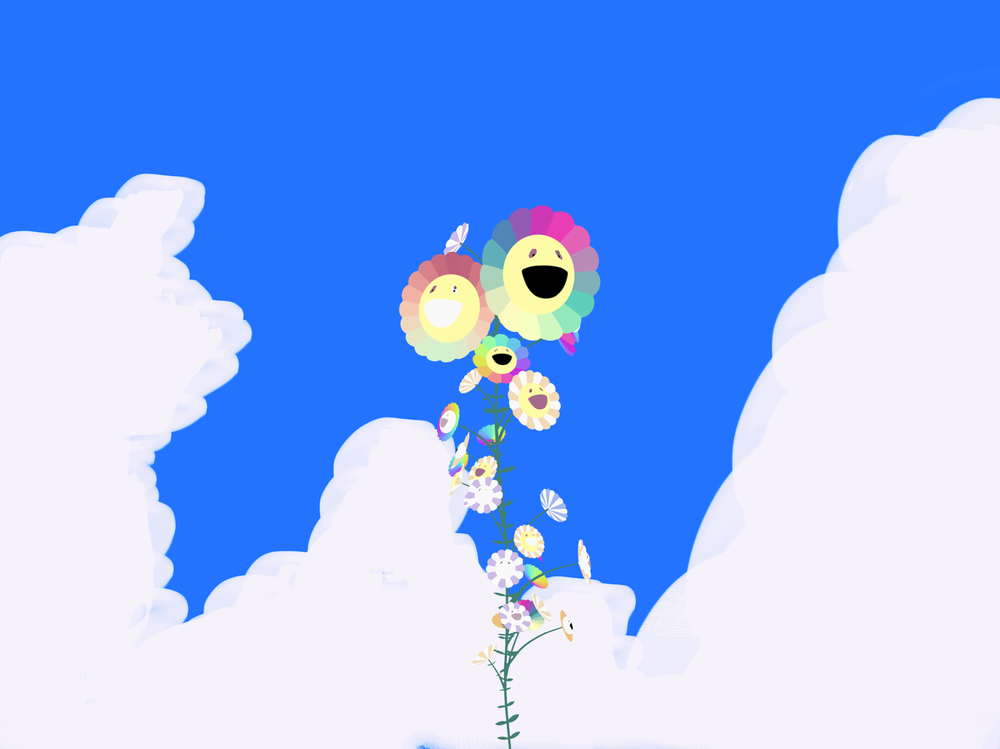
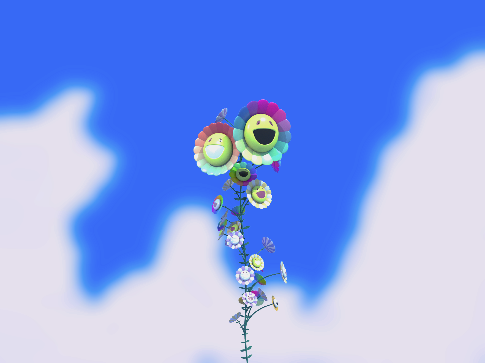
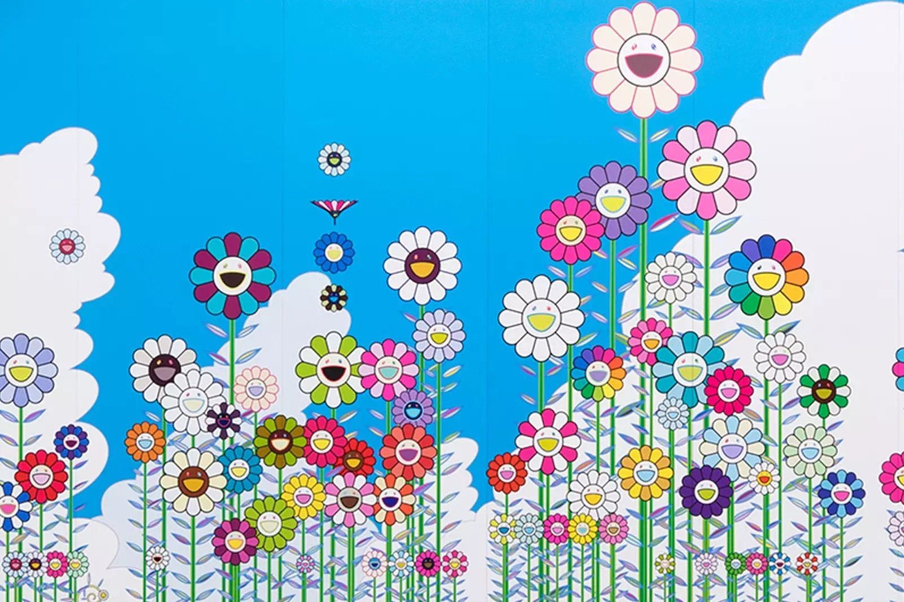
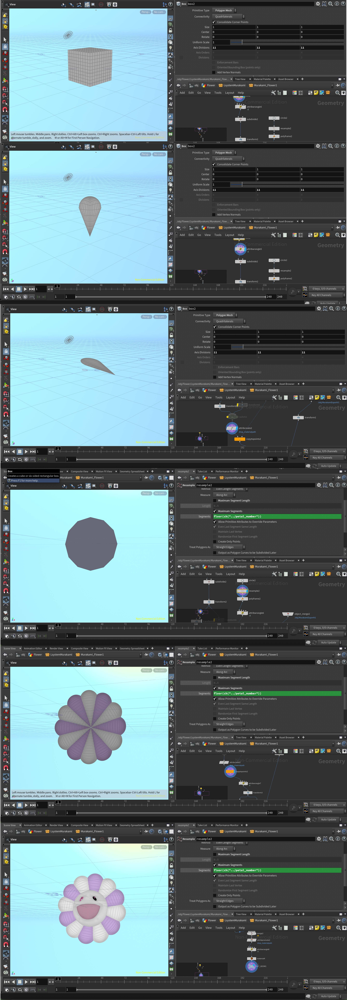
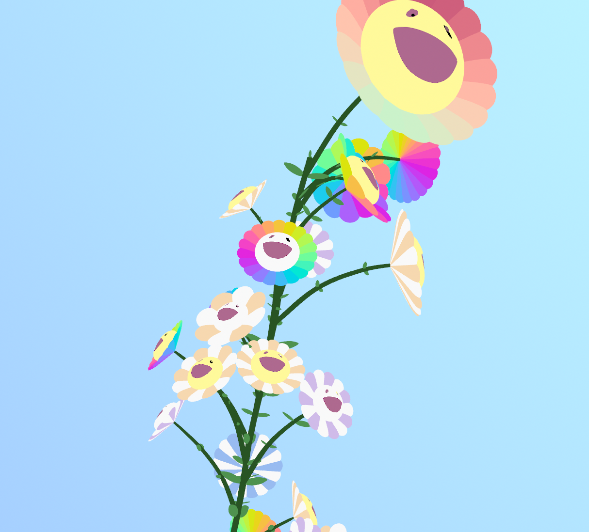
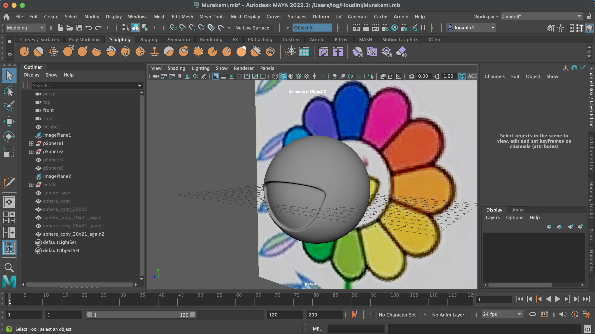

# Procedural Murakami Vine Generator (Houdini Project)





# Description:

For this project, I wanted to try recreate Murakami's Flowers through procedural generation and an L-System. The project can be split into two parts, the first being my HDA Procedural Murakami Flower Generator, and the second being the LSystem itself. I learnt a ton through this project, both about Houdini in general as this is my first time ever using it, and also about tool development workflows. A really helpful resource for me throughout the project was Houdini Kitchen's article, https://www.houdinikitchen.net/2019/12/21/how-to-create-l-systems/, which had examples and definitions of the different utilities that Houdini's L-System primitive provides. 

### Reference:



# Project Overview:

### OBJ Level:


### LSystemMurakami HDA:

Within my 'Flower' geom, I have an L-System Murakami Digital Asset Subnet as follows:


The LSystemHDA takes in # of generations as a parameter, and this would be useful if I ever wanted to spawn many of my vines at varying levels of generations!

#### (Aside)

I wanted to experiment with this idea more, but ran out of time to implement anything further. Will definitely do this in the future when I get the time.


#### (Back to the LSystemHDA Node)


The Lsystem node takes in two different leaves, the first being the flowers, and the second being a simple model of a leaf I modelled in Maya and imported as an FBX into the project (as observable in the OBJ Level screenshot.) 

### Murakami HDA:


The Murakami HDA has two parameters, number of petals, and a float "id" received from the LSystem that is in the range of 0-1. Both are used in the generation process of a flower. I wrote stamp functions for both in order for the LSystem to be able to pass information upstream to the flowers from the rules!

# Procedural Murakami Flower Generator (The Murakami HDA Node): 

https://user-images.githubusercontent.com/72320867/196815779-042a96d9-5559-48f2-9dd6-bb5ff4aaf1d1.mov

Before working on my L-System, I needed to first figure out how I was going to be adding the flowers. One method would be for me to manually create an array of flowers with different features, and then select between when feeding them into the L-System. The more interesting approach that I wanted to take was to create an actual procedural generator which I could use to generate unique flowers on demand within the L-System via stamping parameters up-stream. 

### Process Explanation:



As you can see, I replicate the petal shape of Murakami's Flowers through two main steps. 

1. Firstly, I modelled a petal through deforming a cube, and then used the subdivision node to make the shape smoother. I also apply rotation to the petal based on the node's parameters (id and petal_number), which controls how much the petals fold inwards/outwards in the final result. 

2. Secondly, I segment a primitve circle in order to obtain a regular polygon of points to which I can then copy the petals onto. In order to get the orientation correct and have the petals pointing inwards, I used the polyfram node to replace the tangents of the points with their normals!

Finally, through the copy-to-points node, I am able to get the final petal structure, which is then merged with the face of the flower which I modelled separately in Maya. 

Throughout the node, I also have several wrangles for grouping points into shared characteristics such as a mouth group, left eye group, etc. This is important for when I randomly color the different elements of the flower based on the digital asset's inputs received from the L-System. The geometry spreadsheet was incredibly useful for the grouping portion of this process, as I was able to see the different attributes of points at different parts of the pipeline and quickly debug any issues I was having.

The petals specifically have an interesting color scheme. For instance, if the number of petals is even, it is possible for the petal to have an alternating 2-color scheme, on top of other options such as a cosine color scheme gradient, as well as a uniform color.

# L-System:

### Rules:
```
  - A=[C[G]]Z(t)B
  - C=^(30 + 11 * rand(i+t))F(0.07 + rand(i+t)*0.16, 0.06 + rand(i+t)*0.03)P^(10 + 11 * rand(i+t))F(0.05+ rand(i+t)*0.16,0.05 + rand(i+t)*0.03)P^(5 + 11 * rand(i+t))F(0.03+ rand(i+t)*0.16, 0.04 + rand(i+t)*0.02)D
  - G=J(0.4*(rand(i+t) * 0.6)*(x*x + z*z) + 0.08, 0, 8 + 15 * rand(i / x * y / z + t), rand(i + t))
  - B:rand(i)>0.5=/F(0.005 + 0.03 * rand(i+t))///F(0.05 + 0.03 * rand(i))OA
  - B:rand(i)<=0.5=\\(30 * rand(t))F(0.003 + 0.02 * rand(i+t))\F(0.05 + 0.03 * rand(i))OA
  - D=^(0 + 5*rand(i+t))F(0.01 + 0.03*rand(i+t), 0.015 + rand(i+t)*0.03)E:0.7
  - E=^(0 + 5*rand(i+t))F(0.01 + 0.03*rand(i+t), 0.01 + rand(i+t)*0.03):0.5
  - Z(h)=/(1.0 *h*rand(i+t))^(5*rand(i+t)):0.25
  - Z(h)=\(1.0 *h*rand(i+t))&(5*rand(i+t)):0.25
  - Z(h)=/(1.0 *h*rand(i+t))&(5*rand(i+t)):0.25
  - Z(h)=\(1.0 *h*rand(i+t))^(5*rand(i+t)):0.25
  - X=//G:0.5
  - O=[/(15 * rand(i+t))^(60)-(20 + 20 * rand(i-t))K(0.02 + 0.03 * rand(i+t))][/(15 * rand(i+t) +180)^(60)-(20 + 20 * rand(i-t))K(0.02 + 0.03 * rand(i+t))]
  - P=[/(15 * rand(i+t))^(60)-(20 + 20 * rand(i-t))K(0.01 + 0.02 * rand(i+t))][/(15* rand(i+t) +180)^(60)-(20 + 20 * rand(i-t))K(0.01 + 0.02 * rand(i+t))]
```

Through my L-System rules, I wanted to create a vine that had subtle rotations over generations, little leaves across its main stem and branches, and finally, many diverse Murakami flowers branching off of it. 

One notable feature of the scale of the flowers is that the grow larger the further away from the main stem they are.

The most important aspect of the rules is the use of the rand() function, in order ot add some natural variation to the length of branches, distance between consecutive flowers, pass unique inputs to the flower generator via stamping, and more.


# Conclusion:

I really enjoyed this project. Being new to Houdini made everything extra challenging (this is a huge understatement lol), but now that I've spent all of this time working with it, I've come to see just how great of a tool it can be. I think the final result matches up pretty similarly with the goal I'd had from the beginning, and I think I'm a lot more confident now with actuating my ideas into projects! : )

# Miscellaneous:

### Cool screenshot that I liked



### Modeling the face in Maya:


